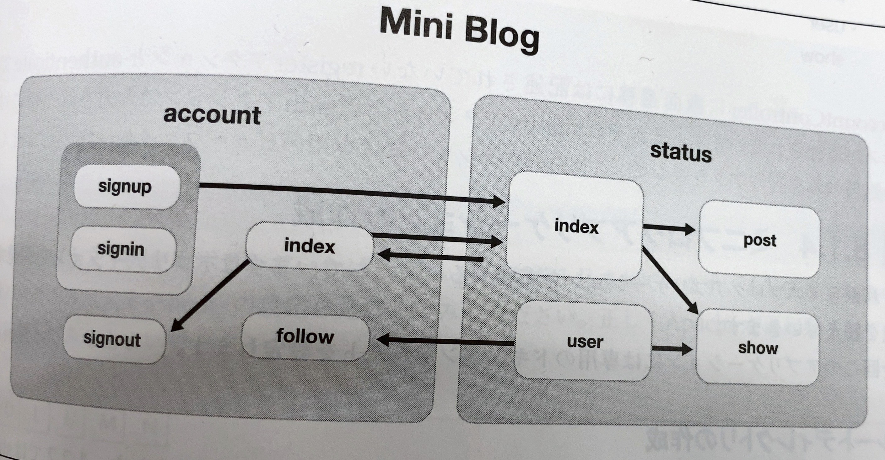

# mini-blog
perfect-php

## 機能一覧
- ユーザアカウント（account）
  - アカウント登録（signup）
  - ログイン（signin） 
  - ログアウト（signout）
  - アカウント情報トップ（index）
  - フォロー（follow）
- ユーザの投稿（status）
  - ホームページ（index）
  - 投稿（post）
  - ユーザの投稿一覧（user）
  - 個別の投稿（show）

## 画面遷移

## コントローラー設計

- AccountController
  - index
  - signup
  - register
  - signin
  - authenticate
  - signout
  - follow
- StatusController
  - index
  - post
  - user
  - show

